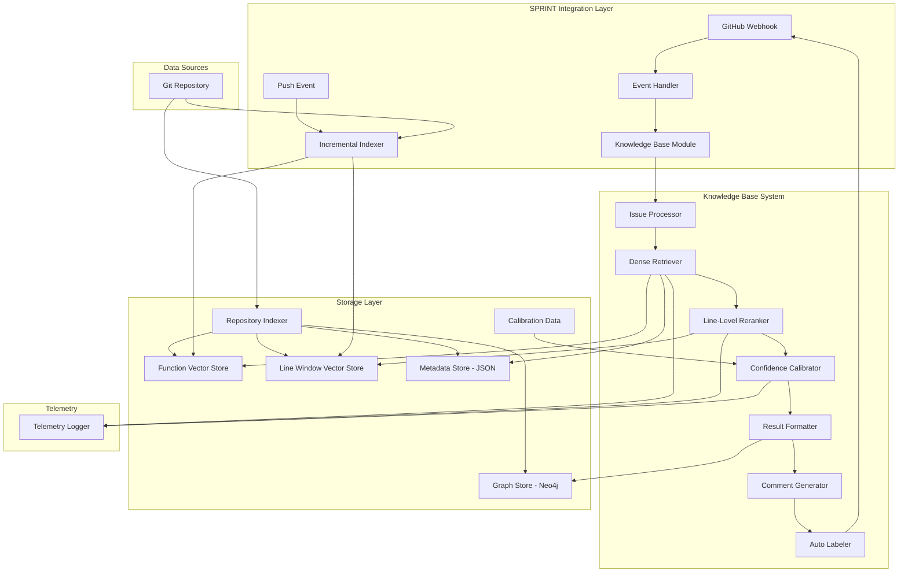

# Knowledge Base System Design Document

## Overview

The Knowledge Base System is a comprehensive code retrieval platform that enhances SPRINT's bug localization capabilities through five progressive phases:

**Phase 1**: Foundational infrastructure with dense embedding-based retrieval and code graph construction using function-level embeddings.

**Phase 2**: Full integration with SPRINT's GitHub app workflow, replacing the existing Llama-2 bug localization with structured JSON output, GitHub comment generation, and telemetry logging.

**Phase 3**: Fine-grained line-level localization using overlapping window embeddings within identified functions, providing precise line ranges for bug candidates.

**Phase 4**: Confidence calibration with validation-based scoring, automatic GitHub labeling based on confidence levels, and reliability metrics.

**Phase 5**: Incremental indexing triggered by GitHub push events, historical version support with per-commit indices, and efficient storage management.

The system operates as a Python module within SPRINT's existing architecture, processing GitHub issues through dense semantic search to identify relevant functions and files, then drilling down to specific line ranges with calibrated confidence scores.

## Architecture

### High-Level System Architecture (All Phases)



### Component Integration with SPRINT

The Knowledge Base System integrates with SPRINT's existing architecture by:

1. **Module Architecture**: Implements as a new module `knowledgeBase.py` in `Feature_Components/KnowledgeBase/`
2. **API Compatibility**: Provides a `BugLocalization()` function signature that replaces existing `bugLocalization.py`
3. **Event Handler Integration**:
   - Called from `processIssueEvents.py` for issue events
   - Hooks into push events for incremental indexing
4. **Repository Access**: Uses SPRINT's existing `getCodeFiles.py` for repository cloning and file access
5. **Comment Generation**: Integrates with `createCommentBugLocalization.py` for structured GitHub comments
6. **Labeling**: Uses GitHub API through SPRINT's authentication to apply confidence labels
7. **Telemetry**: Logs to SPRINT's logging infrastructure with structured metrics

## Components and Interfaces

### 1. Repository Indexer

**Purpose**: Parses and indexes repository code into searchable structures

**Key Components**:

- **Python Parser**: Tree-sitter based parser for Python code (Phase 1 focus)
- **AST Extractor**: Extracts functions and classes with signatures and docstrings
- **Graph Builder**: Constructs Code Knowledge Graph with CALLS, IMPORTS, DEFINES relationships
- **Embedding Pipeline**: Generates dense embeddings using UniXcoder or GraphCodeBERT
- **Metadata Manager**: Stores repository information and indexing status

**Technology Stack**:

- `tree-sitter` and `tree-sitter-python` for parsing
- `torch` and `transformers` for embedding generation
- `neo4j` Python driver for graph storage
- `faiss-cpu` for vector indexing

**Interfaces**:

```python
class RepositoryIndexer:
    def __init__(self, model_name: str, neo4j_uri: str, neo4j_user: str, neo4j_password: str):
        """Initialize indexer with embedding model and graph database connection"""

    def index_repository(self, repo_path: str, repo_name: str) -> IndexResult:
        """Parse repository, extract functions, generate embeddings, build graph"""

    def get_index_status(self, repo_name: str) -> IndexStatus:
        """Check if repository is indexed and get metadata"""
```

### 2. Dense Retriever

**Purpose**: Retrieves relevant functions using semantic similarity search

**Approach**:

- **Single-Channel Dense Retrieval**: Uses function-level embeddings for semantic search
- **Embedding Model**: UniXcoder or GraphCodeBERT for both code and text
- **Vector Search**: FAISS IndexFlatIP for exact inner product search
- **Top-K Selection**: Returns top-10 most similar functions with scores

**Retrieval Process**:

1. Encode issue text using the same model as code embeddings
2. Compute inner product similarity between issue embedding and all function embeddings
3. Rank functions by similarity score (descending)
4. Return top-K functions with metadata (file path, function name, line range, score)

**Technology Stack**:

- `transformers` for model loading and inference
- `faiss-cpu` for similarity search
- `numpy` for vector operations

**Interfaces**:

```python
class DenseRetriever:
    def __init__(self, model_name: str, index_path: str, metadata_path: str):
        """Initialize retriever with embedding model and FAISS index"""

    def retrieve(self, issue_text: str, k: int = 10) -> List[RetrievalResult]:
        """Retrieve top-K most similar functions for given issue text"""

    def load_index(self, repo_name: str) -> bool:
        """Load FAISS index and metadata for specific repository"""
```

### 3. Result Formatter

**Purpose**: Formats retrieval results for SPRINT's comment generation system

**Responsibilities**:

- Aggregate function-level results into file-level summaries
- Extract code snippets for top-ranked functions
- Format results as JSON compatible with SPRINT's existing interface
- Include metadata (repository, commit SHA, timestamp)

**Output Format**:

```json
{
  "repository": "owner/repo",
  "commit_sha": "abc123...",
  "timestamp": "2025-11-09T12:00:00Z",
  "top_files": [
    {
      "file_path": "src/module/file.py",
      "score": 0.87,
      "functions": [
        {
          "name": "process_data",
          "signature": "def process_data(input: str) -> dict:",
          "line_range": [45, 78],
          "score": 0.87,
          "snippet": "def process_data(input: str) -> dict:\n    ..."
        }
      ]
    }
  ]
}
```

**Interfaces**:

```python
class ResultFormatter:
    def format_results(self, retrieval_results: List[RetrievalResult], repo_info: dict) -> dict:
        """Format retrieval results for SPRINT comment generation"""

    def extract_snippet(self, file_path: str, start_line: int, end_line: int) -> str:
        """Extract code snippet from file"""
```

### 4. Issue Processor

**Purpose**: Processes GitHub issues and prepares text for embedding

**Responsibilities**:

- Extract issue title and body text
- Remove markdown formatting and special characters
- Normalize text (lowercase, whitespace)
- Validate minimum text length
- Generate embedding using the same model as code

**Text Processing Pipeline**:

1. Concatenate issue title and body
2. Remove markdown syntax (headers, links, code blocks)
3. Remove special characters and extra whitespace
4. Convert to lowercase
5. Validate length (minimum 10 words)
6. Tokenize and encode using embedding model

**Interfaces**:

```python
class IssueProcessor:
    def __init__(self, model_name: str):
        """Initialize with embedding model"""

    def process_issue(self, issue_title: str, issue_body: str) -> ProcessedIssue:
        """Clean and process issue text, generate embedding"""

    def clean_text(self, text: str) -> str:
        """Remove markdown and special characters"""
```

### 5. Knowledge Base API

**Purpose**: Main entry point for SPRINT integration

**Responsibilities**:

- Provide compatible API with existing `bugLocalization.py`
- Coordinate between Issue Processor, Dense Retriever, Line-Level Reranker, and Confidence Calibrator
- Handle repository indexing status checks
- Manage model loading and caching
- Log telemetry data for monitoring

**Main API Function**:

```python
def BugLocalization(issue_title: str, issue_body: str, repo_owner: str, repo_name: str,
                   repo_path: str, commit_sha: str = None, k: int = 10) -> dict:
    """
    Main API function for bug localization using Knowledge Base System.

    Args:
        issue_title: GitHub issue title
        issue_body: GitHub issue body text
        repo_owner: Repository owner
        repo_name: Repository name
        repo_path: Local path to cloned repository
        commit_sha: Specific commit to localize against (default: HEAD)
        k: Number of top results to return

    Returns:
        Dictionary with top files, functions, line ranges, and confidence scores
    """
```

### 6. Line-Level Reranker (Phase 3)

**Purpose**: Provides fine-grained localization within identified functions

**Approach**:

- **Window Embeddings**: Pre-compute embeddings for overlapping line windows (32-64 tokens)
- **Two-Stage Retrieval**: First retrieve relevant functions, then rerank windows within those functions
- **Local Reranking**: Compute similarity between issue embedding and all windows in top functions
- **Snippet Extraction**: Return best line range with context

**Window Generation Strategy**:

1. Parse function body into tokens using the same tokenizer as embedding model
2. Create overlapping windows with 50% overlap (e.g., 48-token windows with 24-token stride)
3. Generate embeddings for each window
4. Store windows in separate FAISS index with metadata linking to parent function

**Technology Stack**:

- Same embedding model as function-level (UniXcoder/GraphCodeBERT)
- Separate FAISS index for line windows
- Efficient window generation during indexing

**Interfaces**:

```python
class LineReranker:
    def __init__(self, model_name: str, window_index_path: str, window_size: int = 48):
        """Initialize reranker with window embeddings"""

    def rerank_functions(self, issue_embedding: np.ndarray,
                        function_results: List[RetrievalResult]) -> List[LineResult]:
        """For each function, find best line window and return line range"""

    def extract_windows(self, function_body: str, window_size: int, stride: int) -> List[Window]:
        """Generate overlapping windows from function body"""
```

### 7. Confidence Calibrator (Phase 4)

**Purpose**: Maps similarity scores to calibrated confidence levels

**Approach**:

- **Calibration Curve**: Compute on validation set mapping raw scores to true positive rates
- **Binning**: Divide score range into High/Medium/Low confidence bins
- **Validation**: Ensure 90% of High confidence predictions include true bug in Top-3
- **Metadata**: Include confidence in all outputs

**Calibration Process**:

1. Collect validation issues with known buggy functions
2. Run retrieval on validation set and record scores
3. For each score threshold, compute precision@3 (true bug in top-3)
4. Find thresholds where precision@3 ≥ 0.9 (High), ≥ 0.7 (Medium), < 0.7 (Low)
5. Store thresholds in configuration file

**Technology Stack**:

- Scikit-learn for calibration curve computation
- JSON configuration for threshold storage
- Validation dataset from LCA or similar benchmark

**Interfaces**:

```python
class ConfidenceCalibrator:
    def __init__(self, calibration_config_path: str):
        """Load calibration thresholds from config"""

    def calibrate_score(self, similarity_score: float) -> Tuple[str, float]:
        """Map similarity score to confidence level and calibrated probability"""

    def compute_calibration(self, validation_results: List[ValidationResult]) -> dict:
        """Compute calibration curve from validation data"""
```

### 8. Auto Labeler (Phase 4)

**Purpose**: Automatically applies GitHub labels based on confidence

**Responsibilities**:

- Create confidence labels if they don't exist
- Apply appropriate label to issue based on confidence level
- Remove old confidence labels when updating
- Log all labeling actions

**Technology Stack**:

- GitHub API via SPRINT's authentication
- Uses existing `app_authentication.py` for credentials

**Interfaces**:

```python
class AutoLabeler:
    def __init__(self, github_token: str, repo_owner: str, repo_name: str):
        """Initialize with GitHub credentials"""

    def apply_confidence_label(self, issue_number: int, confidence: str) -> bool:
        """Apply confidence label to issue (high/medium/low)"""

    def ensure_labels_exist(self) -> bool:
        """Create confidence labels if they don't exist in repository"""
```

### 9. Incremental Indexer (Phase 5)

**Purpose**: Efficiently updates indices when code changes

**Approach**:

- **Git Diff Analysis**: Compare commits to identify changed files
- **Selective Reindexing**: Only reindex changed files and their dependents
- **Delta Storage**: Store incremental indices as lightweight deltas
- **Version Management**: Maintain per-commit indices with pruning

**Incremental Update Process**:

1. Receive push event with old and new commit SHAs
2. Run `git diff --name-only` to get changed files
3. For each changed file:
   - Remove old function embeddings from index
   - Reparse and generate new embeddings
   - Update graph relationships
4. Save updated index with new commit SHA
5. Optionally create delta index for storage efficiency

**Technology Stack**:

- GitPython for repository operations
- FAISS index merging for efficient updates
- JSON metadata for version tracking

**Interfaces**:

```python
class IncrementalIndexer:
    def __init__(self, repo_path: str, base_indexer: RepositoryIndexer):
        """Initialize with repository and base indexer"""

    def update_index(self, old_commit: str, new_commit: str) -> UpdateResult:
        """Incrementally update index from old to new commit"""

    def get_changed_files(self, old_commit: str, new_commit: str) -> List[str]:
        """Use git diff to identify changed files"""

    def prune_old_indices(self, retention_days: int) -> int:
        """Remove indices older than retention period"""
```

### 10. Telemetry Logger (Phase 2)

**Purpose**: Tracks performance metrics and system health

**Metrics Tracked**:

- Retrieval latency (function-level and line-level)
- Top-K hit counts
- Confidence distribution
- Indexing time and file counts
- Error rates and types

**Technology Stack**:

- Python logging with structured JSON format
- Optional integration with monitoring systems

**Interfaces**:

```python
class TelemetryLogger:
    def __init__(self, log_path: str):
        """Initialize logger with output path"""

    def log_retrieval(self, issue_id: str, latency_ms: float, top_k: int,
                     confidence: str) -> None:
        """Log retrieval metrics"""

    def log_indexing(self, repo_name: str, files_indexed: int,
                    duration_seconds: float) -> None:
        """Log indexing metrics"""

    def get_statistics(self, time_range: str) -> dict:
        """Compute aggregate statistics over time range"""
```

## Data Models

### Code Knowledge Graph Schema (Neo4j)

**Nodes**:

```python
# File Node
{
    "id": "file:<hash>",
    "repo": "owner/repo",
    "path": "src/module/file.py",
    "language": "python",
    "lines_of_code": 250,
    "commit_sha": "abc123..."
}

# Class Node
{
    "id": "class:<hash>",
    "name": "DataProcessor",
    "file_id": "file:<hash>",
    "start_line": 10,
    "end_line": 100
}

# Function Node
{
    "id": "function:<hash>",
    "name": "process_data",
    "file_id": "file:<hash>",
    "class_id": "class:<hash>",  # null if not in class
    "start_line": 45,
    "end_line": 78,
    "signature": "def process_data(input: str) -> dict:",
    "docstring": "Process input data and return structured dict"
}
```

**Relationships** (Phase 1):

- `(:File)-[:CONTAINS]->(:Class)`
- `(:File)-[:CONTAINS]->(:Function)`
- `(:Class)-[:CONTAINS]->(:Function)`
- `(:Function)-[:CALLS]->(:Function)` - extracted from AST
- `(:File)-[:IMPORTS]->(:File)` - extracted from import statements
- `(:Function)-[:DEFINES]->(:Class)` - for class definitions

### Vector Index Metadata (JSON)

Stored alongside FAISS index as `metadata.json`:

```json
{
  "repo": "owner/repo",
  "commit_sha": "abc123...",
  "indexed_at": "2025-11-09T12:00:00Z",
  "total_functions": 1250,
  "functions": [
    {
      "index": 0,
      "id": "function:<hash>",
      "name": "process_data",
      "file_path": "src/module/file.py",
      "class_name": "DataProcessor",
      "start_line": 45,
      "end_line": 78,
      "signature": "def process_data(input: str) -> dict:",
      "docstring": "Process input data and return structured dict"
    }
  ]
}
```

The `index` field corresponds to the position in the FAISS index.

### Retrieval Results

```python
@dataclass
class RetrievalResult:
    function_id: str
    function_name: str
    file_path: str
    class_name: Optional[str]
    start_line: int
    end_line: int
    signature: str
    docstring: Optional[str]
    similarity_score: float  # cosine similarity from FAISS
    confidence: str  # "high", "medium", "low" (Phase 4)
    confidence_score: float  # calibrated probability (Phase 4)

@dataclass
class LineResult:
    function_id: str
    function_name: str
    file_path: str
    line_start: int  # specific line range within function
    line_end: int
    snippet: str  # code snippet for the line range
    similarity_score: float
    confidence: str
    confidence_score: float

@dataclass
class IndexResult:
    repo_name: str
    commit_sha: str
    total_files: int
    total_functions: int
    total_windows: int  # Phase 3
    index_path: str
    metadata_path: str
    window_index_path: str  # Phase 3
    graph_nodes: int
    graph_edges: int
    indexing_time_seconds: float

@dataclass
class UpdateResult:
    repo_name: str
    old_commit: str
    new_commit: str
    files_changed: int
    functions_updated: int
    windows_updated: int
    update_time_seconds: float
```

### Line Window Metadata (Phase 3)

Stored alongside window FAISS index as `window_metadata.json`:

```json
{
  "repo": "owner/repo",
  "commit_sha": "abc123...",
  "window_size": 48,
  "stride": 24,
  "total_windows": 15000,
  "windows": [
    {
      "index": 0,
      "function_id": "function:<hash>",
      "file_path": "src/module/file.py",
      "function_name": "process_data",
      "token_start": 0,
      "token_end": 48,
      "line_start": 45,
      "line_end": 52,
      "text": "def process_data(input: str) -> dict:\n    result = {}\n    ..."
    }
  ]
}
```

### Calibration Configuration (Phase 4)

Stored as `calibration_config.json`:

```json
{
  "model_version": "unixcoder-base",
  "validation_date": "2025-11-09",
  "validation_size": 500,
  "thresholds": {
    "high": {
      "min_score": 0.75,
      "precision_at_3": 0.92
    },
    "medium": {
      "min_score": 0.55,
      "max_score": 0.75,
      "precision_at_3": 0.73
    },
    "low": {
      "max_score": 0.55,
      "precision_at_3": 0.42
    }
  }
}
```

### Version Index Registry (Phase 5)

Stored as `index_registry.json`:

```json
{
  "repo": "owner/repo",
  "indices": [
    {
      "commit_sha": "abc123...",
      "indexed_at": "2025-11-09T12:00:00Z",
      "index_path": "indices/abc123_functions.faiss",
      "window_index_path": "indices/abc123_windows.faiss",
      "metadata_path": "indices/abc123_metadata.json",
      "is_delta": false,
      "parent_commit": null,
      "size_mb": 25.3
    },
    {
      "commit_sha": "def456...",
      "indexed_at": "2025-11-09T14:30:00Z",
      "index_path": "indices/def456_functions.faiss",
      "window_index_path": "indices/def456_windows.faiss",
      "metadata_path": "indices/def456_metadata.json",
      "is_delta": true,
      "parent_commit": "abc123...",
      "size_mb": 2.1
    }
  ]
}
```

## Error Handling

### Indexing Errors

1. **Repository Access Failures**:

   - Validate repository path exists before indexing
   - Log error and return failure status
   - Provide clear error message to caller

2. **Parsing Failures**:

   - Skip files that fail to parse with warning log
   - Continue processing remaining files
   - Track failed files in index metadata

3. **Storage Failures**:
   - Catch Neo4j connection errors and log
   - Catch FAISS write errors and clean up partial files
   - Provide rollback mechanism for failed indexing

### Retrieval Errors

1. **Index Not Found**:

   - Check if repository is indexed before retrieval
   - Return error message indicating indexing required
   - Provide clear instructions for indexing

2. **Model Loading Failures**:

   - Validate model path on initialization
   - Cache loaded models in memory
   - Provide clear error if model files missing

3. **Empty Results**:
   - Handle case where no functions match query
   - Return empty list with appropriate message
   - Log low similarity scores for debugging

### Integration Errors

1. **SPRINT Compatibility**:

   - Validate input parameters (issue text, repo path, commit_sha)
   - Return results in expected format
   - Provide fallback to empty results on failure

2. **File Access Errors**:
   - Handle missing files when extracting snippets
   - Validate line ranges before reading
   - Return partial results if some files unavailable

### Phase 2-5 Specific Errors

1. **GitHub API Errors** (Phase 2, 4):

   - Handle rate limiting with exponential backoff
   - Catch authentication failures and log clearly
   - Retry failed comment/label operations up to 3 times

2. **Line Window Errors** (Phase 3):

   - Handle functions too small for windowing (< 32 tokens)
   - Skip window generation for functions with parsing errors
   - Return function-level results if line-level fails

3. **Calibration Errors** (Phase 4):

   - Use default thresholds if calibration config missing
   - Log warning when confidence cannot be computed
   - Fall back to raw similarity scores

4. **Incremental Indexing Errors** (Phase 5):
   - Handle git command failures gracefully
   - Fall back to full reindexing if diff fails
   - Clean up partial indices on failure
   - Validate commit SHAs before processing

## Testing Strategy

### Unit Testing

**Repository Indexer Tests**:

- Python parser correctly extracts functions and classes
- Function signatures and docstrings extracted accurately
- Graph nodes and relationships created correctly
- Embeddings generated with correct dimensions
- Metadata JSON written with all required fields

**Dense Retriever Tests**:

- FAISS index loads correctly
- Similarity search returns top-K results
- Scores are in valid range [0, 1]
- Results sorted by descending score
- Metadata lookup works for all indices

**Issue Processor Tests**:

- Markdown formatting removed correctly
- Text normalized to lowercase
- Minimum length validation works
- Embedding generation produces correct shape
- Special characters handled properly

**Result Formatter Tests**:

- Function results aggregated by file correctly
- Code snippets extracted with correct line ranges
- JSON output matches expected schema
- File paths are relative to repository root
- Metadata fields populated correctly

### Integration Testing

**End-to-End Workflow**:

- Index a small test repository (10-20 files)
- Process a test issue and retrieve results
- Verify results contain expected functions
- Check result format compatible with SPRINT
- Validate all metadata fields present

**Storage Integration**:

- FAISS index persists and loads correctly
- Neo4j graph persists across restarts
- Metadata JSON readable after write
- Multiple repositories can be indexed separately

### Performance Testing

**Indexing Performance**:

- Measure time to index 1000 Python functions
- Monitor memory usage during indexing
- Verify index files written to disk
- Check graph database size

**Retrieval Performance**:

- Measure query time for single issue (target: < 1 second)
- Test with varying K values (5, 10, 20)
- Monitor memory usage during retrieval
- Verify results returned within timeout

### Manual Testing

**SPRINT Integration** (Phase 2):

- Replace existing `bugLocalization.py` with new module
- Process real GitHub issue through SPRINT webhook
- Verify structured comment generated correctly with markdown formatting
- Check GitHub labels applied correctly
- Verify telemetry logs written
- Confirm end-to-end latency < 10 seconds

**Line-Level Localization** (Phase 3):

- Test on issues with known buggy lines
- Verify line ranges highlighted in comments
- Check IoU metric on validation set
- Confirm window embeddings generated correctly

**Confidence Calibration** (Phase 4):

- Run calibration on validation dataset
- Verify High confidence predictions have 90%+ precision@3
- Check confidence labels applied to issues
- Validate confidence scores in API output

**Incremental Indexing** (Phase 5):

- Trigger push event with code changes
- Verify only changed files reindexed
- Check incremental update completes < 2 seconds
- Test version-specific localization with historical commits
- Verify index pruning removes old indices

## Performance Considerations (All Phases)

### Indexing Performance

**Phase 1 (Function-Level)**:

- **Sequential Processing**: Process files one at a time for simplicity
- **Model Caching**: Load embedding model once and reuse for all functions
- **Batch Embedding**: Generate embeddings in batches of 32 functions
- **Target**: Index 5,000 Python files in under 15 minutes

**Phase 3 (Line-Level)**:

- **Window Generation**: Create windows during function parsing
- **Batch Window Embedding**: Process 64 windows per batch
- **Parallel Processing**: Use multiprocessing for window generation
- **Target**: Add line-level indexing with < 30% overhead (< 20 minutes total)

**Phase 5 (Incremental)**:

- **Selective Reindexing**: Only process changed files
- **Delta Indices**: Store only differences when possible
- **Target**: < 2 seconds for < 20 changed files

### Query Performance

**Phase 1-2 (Function Retrieval)**:

- **In-Memory Index**: Load FAISS index into memory on startup
- **Fast Similarity Search**: Use IndexFlatIP for exact search
- **Metadata Lookup**: Load metadata JSON into memory
- **Target**: < 1 second for function retrieval

**Phase 3 (Line Reranking)**:

- **Two-Stage Retrieval**: First functions, then windows
- **Local Reranking**: Only search windows in top-10 functions
- **Target**: < 2 seconds additional for line-level localization

**Phase 4 (Confidence)**:

- **Lookup Table**: Use pre-computed thresholds
- **No Additional Latency**: Confidence mapping is O(1)

**End-to-End Target (Phase 2)**: < 10 seconds from issue creation to comment posted

### Storage Requirements

**Phase 1**:

- **FAISS Index**: ~4KB per function (768-dim float32 embeddings)
- **Metadata JSON**: ~500 bytes per function
- **Neo4j Graph**: ~1KB per node, ~100 bytes per edge
- **Example**: 5,000 functions = ~20MB FAISS + ~2.5MB metadata + ~5MB graph

**Phase 3**:

- **Window FAISS Index**: ~4KB per window
- **Window Metadata**: ~300 bytes per window
- **Ratio**: ~10 windows per function on average
- **Example**: 5,000 functions = 50,000 windows = ~200MB window index + ~15MB metadata

**Phase 5**:

- **Per-Commit Indices**: Full index per commit initially
- **Delta Indices**: ~10-20% of full index size for incremental updates
- **Pruning**: Keep last 30 days by default
- **Example**: 10 commits over 30 days = ~250MB total (with deltas)

### Optimization Strategies

1. **Lazy Loading**: Load indices only when needed for specific repositories
2. **Index Compression**: Use FAISS quantization for older indices
3. **Caching**: Cache recent query results for duplicate issues
4. **Async Processing**: Process GitHub webhooks asynchronously
5. **Batch Operations**: Group multiple index updates when possible

## GitHub Comment Format (Phase 2-4)

### Structured Comment Template

The system generates markdown-formatted GitHub comments with the following structure:

````markdown
## 🔍 Bug Localization Results

**Confidence:** High (92% probability) 🟢

I've analyzed this issue and identified the most likely locations for the bug:

### Top Candidate Functions

#### 1. `process_data` in `src/module/processor.py` (Score: 0.87)

**Lines 45-78** | [View on GitHub](https://github.com/owner/repo/blob/abc123/src/module/processor.py#L45-L78)

```python
def process_data(input: str) -> dict:
    result = {}
    # Parse input string
    parts = input.split(',')
    for part in parts:
        key, value = part.split('=')  # ⚠️ Likely bug location (Lines 50-52)
        result[key] = value
    return result
```
````

**Why this function?** High semantic similarity to issue description. The function handles data parsing which matches the reported error.

---

#### 2. `validate_input` in `src/module/validator.py` (Score: 0.76)

**Lines 23-35** | [View on GitHub](https://github.com/owner/repo/blob/abc123/src/module/validator.py#L23-L35)

```python
def validate_input(data: str) -> bool:
    if not data:
        return False
    return '=' in data and ',' in data
```

---

### Summary

- **Total functions analyzed:** 1,247
- **Retrieval time:** 1.2s
- **Commit:** abc123...
- **Indexed:** 2025-11-09 12:00 UTC

**Labels applied:** `bug-localization:high-confidence`

---

_This analysis was generated by SPRINT's Knowledge Base System. [Learn more](https://github.com/sprint/docs)_

```

### Comment Formatting Rules

1. **Confidence Badge**: Use emoji indicators (🟢 High, 🟡 Medium, 🔴 Low)
2. **Clickable Links**: Generate GitHub permalink URLs with line ranges
3. **Code Snippets**: Include top-5 functions with syntax highlighting
4. **Line Highlighting**: Mark specific line ranges when Phase 3 is active
5. **Metadata Footer**: Include retrieval stats and commit information
6. **Responsive Design**: Format works on mobile and desktop GitHub

## Security Considerations (Phase 1)

### Data Protection

- **Local Storage**: All indices stored locally in SPRINT's data directory
- **Repository Access**: Uses SPRINT's existing repository cloning mechanism
- **No External APIs**: All processing done locally with no external calls

### Input Validation

- **Path Validation**: Verify repository paths exist and are accessible
- **Text Sanitization**: Clean issue text to prevent injection attacks
- **Parameter Validation**: Check K value is positive integer, paths are valid

### Error Handling

- **Graceful Degradation**: Return empty results on failure rather than crashing
- **Logging**: Log all errors with context for debugging
- **No Sensitive Data**: Avoid logging repository content or issue details
```
