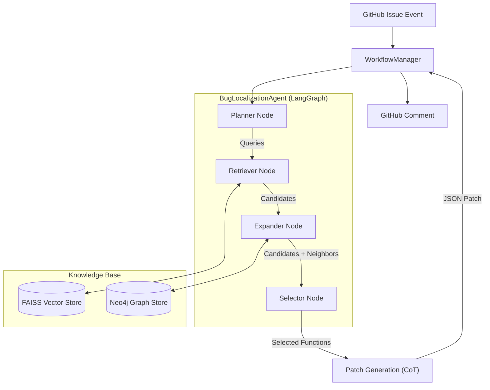

# INSIGHT - Automated Bug Localization

## System Overview

INSIGHT (Issue Analyzing Tool) is a GitHub application that provides automated bug localization and technical analysis using a **RAG (Retrieval-Augmented Generation)** pipeline. It combines semantic search with LLM-powered analysis to identify buggy code and suggest fixes.

**Key Features:**
- **RAG-based Localization**: Dense vector retrieval + LLM re-ranking
- **Smart Query Generation**: LLM generates optimized search queries
- **Graph Enrichment**: Adds caller/callee context from code knowledge graph
- **Multi-Language Support**: Python, Java, Kotlin
- **GitHub Integration**: Automated knowledge base updates on code changes

## Architecture


## Core Components

### 1. BugLocalizationAgent (`agent.py`)
The intelligent core built on **LangGraph**. It replaces the legacy linear pipeline with a stateful agent:
- **Planner Node**: Breaks down the issue into multiple semantic search queries.
- **Retriever Node**: Executes queries against the Jina embedding index.
- **Expander Node**: Crawls the Knowledge Graph (1-hop `CALLS` relationships) to find contextually relevant code not found by keywords.
- **Selector Node**: Uses LLM to reason over the expanded set and identify the root cause.

### 2. Knowledge Base Components

#### Vector Store (`vector_store.py` + FAISS)
- Stores embeddings of Files, Classes, and Functions.
- **Model**: `jinaai/jina-embeddings-v2-base-code` (8k context window).
- Supports semantic search with dot-product similarity.

#### Graph Store (`graph_store.py` + Neo4j)
- Stores structural relationships: `CONTAINS`, `CALLS`, `INHERITS`.
- Enables "Graph-Augmented" retrieval (finding callers of a buggy function).

#### Repository Indexer (`indexer.py`)
- Hybrid indexer using `tree-sitter`.
- Generates AST-based chunks (Function/Class skeletons).
- Populates both FAISS (Vectors) and Neo4j (Graph) simultaneously.

### 3. LLM Service (`llm_service.py`)
Provides model-agnostic LLM access (GPT-4o, Gemini) with advanced capabilities:
- **Chain-of-Thought Patching**: Generates patches + commit messages using a 5-step reasoning process (Strategy -> Rationale -> Design -> Verification -> Quality).
- **JSON Enforcement**: Ensures outputs are strictly structured for automation.
- **Retry Logic**: Exponential backoff handling for API limits.

### 4. Workflow Manager (`workflow_manager.py`)
The orchestrator that binds the Agent to the Application layer:
1.  **State Management**: Initializes agent state with repository context.
2.  **Execution**: Invokes the `BugLocalizationAgent` graph.
3.  **Patching**: Feeds the localized functions to the CoT Patch Generator.
4.  **Result Formatting**: Packages the analysis and patch for the user.

## Data Flow

### Indexing Phase
```
Repository → Parse (tree-sitter) → Extract AST Nodes →
  ├─ Embedding (Jina v2) → FAISS
  └─ Build Knowledge Graph → Neo4j
```

### Localization & Repair Phase
```
GitHub Issue → WorkflowManager →
  [Agent]
  1. Planner: "Search for X, Y, Z"
  2. Retriever: Vector Search (FAISS) → Top Candidates
  3. Expander: Get Neighbors (Neo4j) → Expanded Candidates
  4. Selector: LLM Reasoning → Root Cause Function
  [Patching]
  5. CoT Patch Generator: Strategy -> Verify -> JSON Patch
→ GitHub Comment
```

## Technology Stack

| Component | Technology | Purpose |
|:---|:---|:---|
| **Language** | Python 3.11+ | Core implementation |
| **Agent Framework** | LangGraph | State machine orchestration |
| **LLM** | GPT-4o / Gemini 2.0 | Reasoning and generation |
| **Embeddings** | Jina Embeddings v2 | 8k context code embeddings |
| **Vector Search** | FAISS | Similarity search |
| **Graph DB** | Neo4j | Knowledge graph |
| **Parsing** | tree-sitter | AST extraction |
| **Web Framework** | Flask | Webhook handling |

## Evaluation Results

On the [LCA Bug Localization benchmark](https://huggingface.co/datasets/JetBrains-Research/lca-bug-localization):

**File-Level**:
- Hit@3: **59.52%**
- Precision@5: **56.75%**
- Recall@5: **43.00%**
- F1@5: **48.93%**

**Function-Level**:
- Hit@3: **54.76%**
- F1@5: **42.79%**

## Storage

- **SQLite**: Repository metadata, indexing status
- **FAISS**: Embeddings for Files, Classes, and Functions (one index per repository)
- **Neo4j**: Code knowledge graph (shared across repositories)
- **Local Files**: Cloned repositories (temporary)
