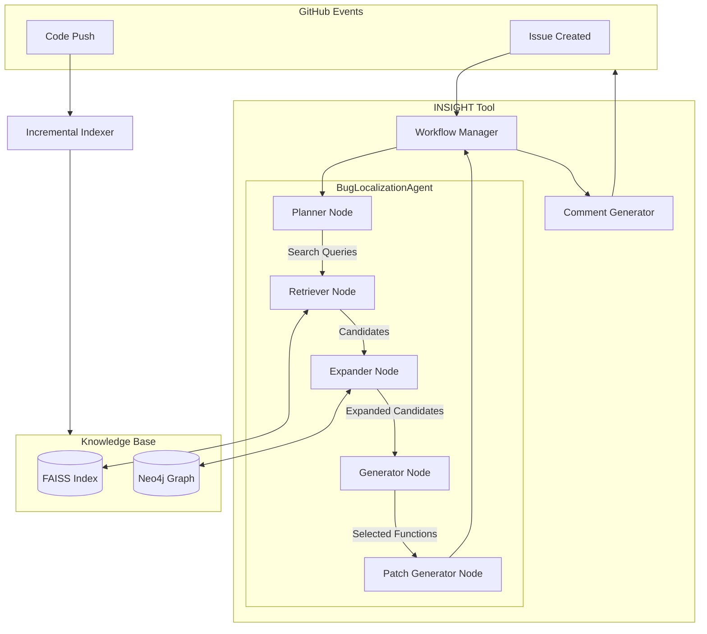
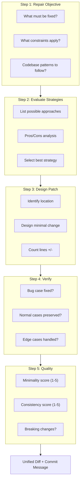

# INSIGHT - Automated Bug Localization

## System Overview

INSIGHT (Issue Analyzing Tool) is a GitHub application that provides automated bug localization and patch generation using an **Agentic RAG (Retrieval-Augmented Generation)** pipeline. It combines semantic search, knowledge graph expansion, and LLM-powered Chain-of-Thought reasoning to identify buggy code and suggest fixes.

**Key Features:**
- **Agentic RAG Pipeline**: LangGraph-based multi-step agent (Planner → Retriever → Expander → Generator)
- **Smart Query Generation**: LLM generates optimized semantic and lexical search queries
- **Graph Enrichment**: Expands candidates with 1-hop caller/callee neighbors from Neo4j
- **Chain-of-Thought Patching**: 5-step structured reasoning based on ThinkRepair (ISSTA 2024)
- **Multi-Language Support**: Python, Java, Kotlin
- **GitHub Integration**: Automated knowledge base updates on code changes

## Architecture Overview



## Agent Pipeline (Detailed)

The `BugLocalizationAgent` is the intelligent core, built with **LangGraph**. It implements a multi-step reasoning pipeline:

```mermaid
flowchart LR
    subgraph Planner["1. Planner Node"]
        direction TB
        P1["Analyze Issue"]
        P2["Generate Semantic Queries"]
        P3["Generate Lexical Queries"]
        P4["Identify Must-Include Tokens"]
    end
    
    subgraph Retriever["2. Retriever Node"]
        direction TB
        R1["Embed Queries"]
        R2["Hybrid Search<br/>(Dense + BM25 + RRF)"]
        R3["Token Filtering"]
        R4["LLM Reranking"]
    end
    
    subgraph Expander["3. Expander Node"]
        direction TB
        E1["Get Top-K Seeds"]
        E2["Query Graph Neighbors"]
        E3["Query Siblings"]
        E4["Hydrate from Index"]
    end
    
    subgraph Generator["4. Generator Node"]
        direction TB
        G1["Format Candidates with Code"]
        G2["Claim-Evidence Mapping"]
        G3["Select Root Cause"]
    end
    
    subgraph PatchGen["5. Patch Generator Node"]
        direction TB
        CoT1["Step 1: Objective & Constraints"]
        CoT2["Step 2: Evaluate Strategies"]
        CoT3["Step 3: Design Minimal Patch"]
        CoT4["Step 4: Verify Correctness"]
        CoT5["Step 5: Assess Quality"]
    end
    
    Planner --> Retriever
    Retriever --> Expander
    Expander --> Generator
    Generator -->|"generate_patch=True"| PatchGen
    Generator -->|"generate_patch=False"| END["END"]
    PatchGen --> END
```



### Node Descriptions

| Node | Purpose | Key Techniques |
|------|---------|----------------|
| **Planner** | Analyze issue and generate search plan | LLM query decomposition |
| **Retriever** | Find candidate functions | Hybrid search (Dense + BM25), RRF fusion, LLM reranking |
| **Expander** | Enrich candidates with graph context | 1-hop CALLS/CALLED_BY traversal, sibling discovery |
| **Generator** | Identify root cause with evidence | Claim-Evidence mapping, grounded selection |
| **Patch Generator** | Generate fix with CoT reasoning | ThinkRepair methodology (ISSTA 2024) |

## Core Components

### 1. BugLocalizationAgent (`agent.py`)

The intelligent core built on **LangGraph**. Key capabilities:

- **State Management**: Tracks candidates, selected functions, token usage, and patch output
- **Conditional Workflow**: Patch generation is optional (controlled by `generate_patch` flag)
- **Grounded Generation**: Generator node requires evidence citations from code snippets

**Usage:**
```python
from Feature_Components.Agent.agent import BugLocalizationAgent

agent = BugLocalizationAgent(repo_name="user/repo", repo_dir="/path/to/repo")
selected, candidates, tokens, patch, reasoning = agent.localize(
    issue_title="Bug: Crash on invalid input",
    issue_body="...",
    generate_patch=True  # Set False for evaluation-only mode
)
```

### 2. Chain-of-Thought Patch Generation

Based on recent LLM program repair research:

| Paper | Venue | Contribution |
|-------|-------|--------------|
| **ThinkRepair** (Yin et al.) | ISSTA 2024 | Self-directed CoT reasoning |
| **SCoT** (Li et al.) | TOSEM 2025 | Structured intermediate reasoning |

**5-Step Process:**



### 3. Knowledge Base Components

#### Vector Store (`vector_store.py` + FAISS)
- Stores embeddings of Files, Classes, and Functions
- **Model**: `jinaai/jina-embeddings-v2-base-code` (8k context window)
- Supports hybrid search with BM25 sparse retrieval

#### Graph Store (`graph_store.py` + Neo4j)
- Stores structural relationships: `CONTAINS`, `CALLS`, `INHERITS`
- Enables "Graph-Augmented" retrieval (finding callers/callees of buggy functions)
- Supports sibling discovery (functions in same class/file)

#### Repository Indexer (`indexer.py`)
- Hybrid indexer using `tree-sitter` for AST extraction
- Generates function/class skeletons with signatures and docstrings
- Populates both FAISS (vectors) and Neo4j (graph) simultaneously

### 4. Workflow Manager (`workflow_manager.py`)

Orchestrates the Agent with the Application layer:

- **Initialization**: Creates `BugLocalizationAgent` for the target repository
- **Execution**: Invokes agent with optional patch generation
- **Result Packaging**: Formats output for GitHub comment posting

**Usage:**
```python
from Feature_Components.KnowledgeBase.workflow_manager import WorkflowManager

manager = WorkflowManager()
result = manager.run(
    issue_title="Bug: ...",
    issue_body="...",
    repo_name="user/repo",
    repo_path="/path/to/repo",
    generate_patch=True  # Default: True
)

print(result["llm_patch"])  # Contains CoT reasoning + unified diff
```

## Data Flow

### Indexing Phase
```
Repository → Parse (tree-sitter) → Extract AST Nodes →
  ├─ Embedding (Jina v2) → FAISS Index
  └─ Build Knowledge Graph → Neo4j
```

### Localization & Repair Phase
```
GitHub Issue → WorkflowManager →
  [Agent Pipeline]
  1. Planner: Decompose issue → Search queries
  2. Retriever: Hybrid search (FAISS) → Top candidates  
  3. Expander: Graph expansion (Neo4j) → Enriched candidates
  4. Generator: LLM reasoning → Root cause selection
  5. Patch Generator (optional): CoT reasoning → Unified diff
→ Comment Generator → GitHub Comment
```

## Technology Stack

| Component | Technology | Purpose |
|:----------|:-----------|:--------|
| **Language** | Python 3.11+ | Core implementation |
| **Agent Framework** | LangGraph | State machine orchestration |
| **LLM** | GPT-4o / Gemini 2.0 | Reasoning and generation |
| **Embeddings** | Jina Embeddings v2 | 8k context code embeddings |
| **Vector Search** | FAISS | Similarity search |
| **Sparse Retrieval** | BM25 | Lexical matching |
| **Graph DB** | Neo4j | Code knowledge graph |
| **Parsing** | tree-sitter | Multi-language AST extraction |
| **Web Framework** | Flask | Webhook handling |

## Evaluation Results

On the [LCA Bug Localization benchmark](https://huggingface.co/datasets/JetBrains-Research/lca-bug-localization):

**File-Level:**
- Hit@3: **59.52%**
- Precision@5: **56.75%**
- Recall@5: **43.00%**
- F1@5: **48.93%**

**Function-Level:**
- Hit@3: **54.76%**
- F1@5: **42.79%**

### Running Evaluation

```bash
cd "Replication Package/Evaluation/Bug Localization"
python evaluate_bug_localization.py
```

To run without patch generation (faster):
```python
# In evaluate_bug_localization.py
result = workflow_manager.run(..., generate_patch=False)
```

## Storage

- **SQLite**: Repository metadata, indexing status
- **FAISS**: Embeddings for Files, Classes, and Functions (one index per repository)
- **Neo4j**: Code knowledge graph (shared across repositories)
- **Local Files**: Cloned repositories (temporary)

## References

- Yin, X., et al. (2024). *ThinkRepair: Self-Directed Automated Program Repair*. ISSTA 2024.
- Li, J., et al. (2025). *Structured Chain-of-Thought Prompting for Code Generation*. ACM TOSEM.
