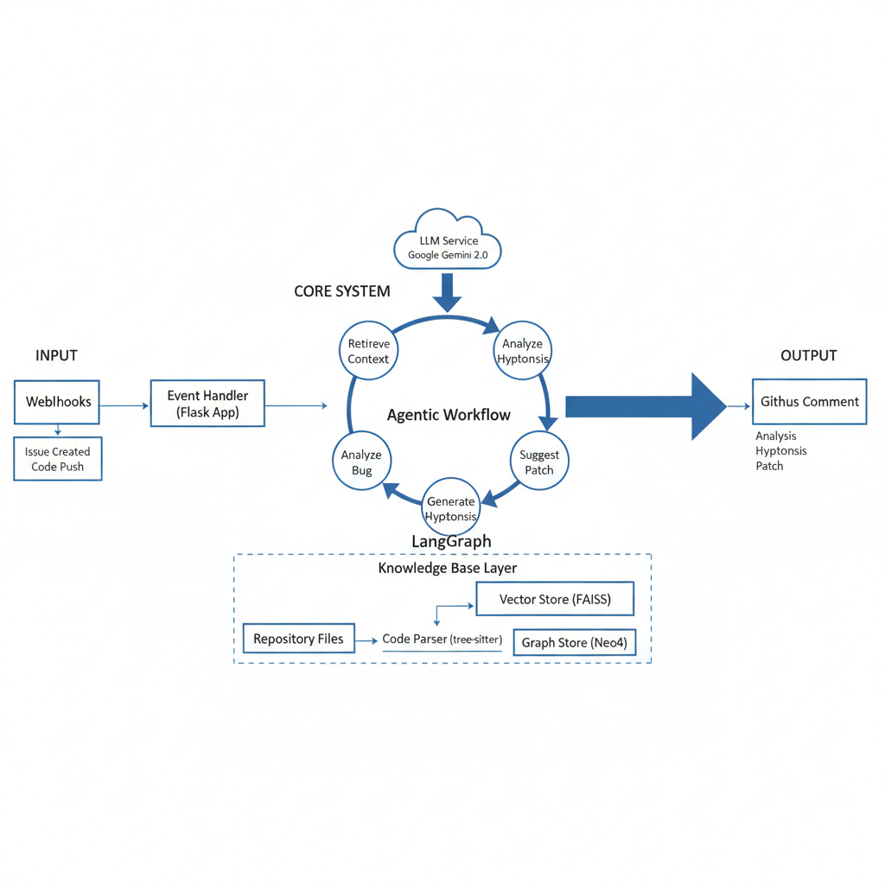

<p align="center">
  
</p>

<h1 align="center">SPRINT (iSsue rePoRt assIstaNT)</h1>

## What is SPRINT?

SPRINT is an open-source GitHub application that provides automated bug localization assistance for developers, project managers, computer science students, and educators. Using a Knowledge Base system with vector similarity search, SPRINT analyzes reported issues and predicts which code files likely need modification to resolve the issue.

---

## Install SPRINT:

SPRINT can be installed as a GitHub app on any GitHub repository. The installation link of SPRINT is given below, using which a user can install SPRINT on one or many repositories.

:link: [Install SPRINT](https://github.com/apps/sprint-issue-report-assistant)

---

## About this Repository

This repository hosts the code, resources, and supporting materials for the **SPRINT Tool**. It is organized into the following folders:

### Replication Package

This folder contains all materials necessary to replicate the experiments, evaluations, and studies conducted for SPRINT. It is further divided into the following subfolders:

- **Evaluation**: Includes evaluation guidelines and results for bug localization.
- **SPRINT Test Cases**: Provides sample test cases to test bug localization functionality.
- **User Study**: Contains the user study questionnaire and survey results related to SPRINT.

### SPRINT Tool

This folder contains the core codebase for the SPRINT tool. The accompanying `README.md` file provides detailed instructions on how to run and customize SPRINT to suit your requirements.

### assets

This folder holds images and other utility files used throughout the repository, including visuals for documentation purposes.

Feel free to explore these folders for a comprehensive understanding of SPRINT and its functionality.

---

## SPRINT in Action:

<p align="center">
  
</p>

When a new issue is reported, SPRINT fetches that issue and analyzes it using its Knowledge Base system. After analysis, SPRINT generates a comment with bug localization predictions:

**Bug Localization**:  
SPRINT generates a comment containing a list of code files along with their URLs and relevant functions that likely require modification to solve the issue. The predictions include:

- File paths with direct links to the code
- Specific functions within those files
- Confidence level (high, medium, low) for the predictions
- Line-level suggestions when available

The code file URLs can take users directly to the respective code files for further inspection.

---

## SPRINT's Architecture:

SPRINT is implemented using Python's Flask framework with a Knowledge Base system:

<p align="center">
  
</p>

1. **Issue Indexer**:

   - Fetches and stores existing issues in a local database for efficient access.
   - Applies page-based indexing to partition issues for efficient fetching.

2. **GitHub Event Listener**:

   - Monitors new issues using GitHub Webhooks and fetches them for processing.
   - Sends the reported issues and code files to the Knowledge Base system for analysis.
   - Formats the output and sends bug localization predictions back to GitHub.

3. **Knowledge Base System**:

   - Automatically indexes repository code structure on installation
   - Uses vector similarity search (FAISS) for efficient code retrieval
   - Parses code with tree-sitter for Python and Java
   - Provides function-level granularity in predictions
   - Calibrates confidence scores based on similarity metrics
   - Updates automatically on push events to main/master branch

4. **Other Utilities**:
   - **Thread Pool Executor**: Enables concurrent processing of multiple webhook events.
   - **Data Storage**: Uses a local SQLite database to store and index issues.
   - **Neo4j Graph Database**: Stores code relationships and structure for enhanced retrieval.

---

## How can I contribute to SPRINT?

We are more than happy to receive your contributions (any kind of contributions). If you have an idea of a feature or enhancement, or if you find a bug, please open an issue (or a pull request). If you have questions, feel free to contact us: <a href="https://github.com/adnan23062000">Ahmed Adnan</a> (bsse1131@iit.du.ac.bd), <a href="https://github.com/antu-saha">Antu Saha</a> (asaha02@wm.edu), and <a href="">Oscar Chaparro</a> (oscarch@wm.edu)

---

## How do I customize and run SPRINT on my server?

SPRINT is a tool for bug localization using Knowledge Base technology. A user can run SPRINT and customize it by following the instructions given below.

**Step 1:**

Clone the repository

**Step 2:**

Install dependencies

```bash
pip install -r requirements.txt
```

No model downloads are required - the Knowledge Base system builds indices automatically when you install the app on a repository.

**Hardware Requirements:**

- **CPU**: Any modern CPU (no GPU required)
- **Memory**: 8GB RAM recommended (scales with repository size)
- **Storage**: ~1-2GB per indexed repository

**Step 3:**

Install ngrok from (https://ngrok.com/download) [This will create a secure tunnel from a public endpoint (Github repository) to a locally running network service (our project running in localhost)]

**Step 4:**

Create a new GitHub application. You need to go to the following path:

`Settings -> Developer's Settings -> New GitHub App`

Make sure in 'Repository Permissions' section of the GitHub application, there is Read and Write access to 'Actions', 'Webhooks' and 'Issues'. After saving the GitHub application, there will be an option to Generate a private access token (this token will enable permission for SPRINT to fetch and post data to a user's Github repositories). Generate this token and then copy and paste app id, client id, and github private access token/private key to the `.env` file of the cloned code.

**Step 5:**

Open the cloned project in IDE and configure the `.env` file with your GitHub App credentials:

```
GITHUB_PRIVATE_KEY=<your-private-key>
GITHUB_APP_ID=<your-app-id>
CLIENT_ID=<your-client-id>
POOL_PROCESSOR_MAX_WORKERS=4
```

Then, run the following 2 commands in 2 different terminals:

```bash
ngrok http 5000

python main.py
# or
python -m main
```

**Step 6:**

Go to the repository where you need to run the tool. Go to -

`Settings -> Webhooks -> Add Webhook `

Then copy the forwarding address shown after running the command `ngrok http 5000` or `./ngrok http 5000` (if ngrok.exe is in your SPRINT Tool folder) into the Payload URL section of Add Webhook.

Make sure 'Which events would you like to trigger this webhook?' section has 'Issues' and 'Push events' checkboxes checked.

**Step 7:**

Install the GitHub App on your repository. SPRINT will automatically:

- Index the repository's code structure
- Build the Knowledge Base
- Start processing new issues

Create issues in that repository and see SPRINT work!

---

# SPRINT API Documentation

## Overview

SPRINT provides bug localization using a Knowledge Base system. The feature is implemented as a Python function-based API and can be used within your project. Below is a guide on how to interact with the API, the expected inputs, outputs, and how to modify or customize its behavior.

---

## Bug Localization (Knowledge Base)

### **Function**

`BugLocalization(issue_title, issue_body, repo_owner, repo_name, repo_path, commit_sha=None, k=10, enable_line_level=True)`

### **Purpose**

Predicts the most likely buggy code files and functions that might require modification to fix the issue using vector similarity search over a Knowledge Base of the repository's code.

### **Input Parameters**

- `issue_title`: _String_. The title of the issue.
- `issue_body`: _String_. The description/body of the issue.
- `repo_owner`: _String_. The repository owner (e.g., "microsoft").
- `repo_name`: _String_. The repository name (e.g., "vscode").
- `repo_path`: _String_. Local path to the cloned repository.
- `commit_sha`: _String_ (optional). Specific commit SHA to use.
- `k`: _Integer_ (optional, default=10). Number of top results to return.
- `enable_line_level`: _Boolean_ (optional, default=True). Enable line-level reranking.

### **Output**

- **Returns:** _Dictionary_ with the following structure:
  ```python
  {
      'repository': 'owner/repo',
      'commit_sha': 'abc123...',
      'total_results': 10,
      'confidence': 'high',  # or 'medium', 'low'
      'confidence_score': 0.85,
      'top_files': [
          {
              'file_path': 'src/main.py',
              'score': 0.92,
              'functions': ['process_data', 'validate_input']
          },
          ...
      ],
      'line_level_results': [  # if enable_line_level=True
          {
              'function_name': 'process_data',
              'file_path': 'src/main.py',
              'line_start': 45,
              'line_end': 67,
              'snippet': '...',
              'score': 0.89,
              'confidence': 'high'
          },
          ...
      ]
  }
  ```

### **Customization**

- **Embedding Model:** The default model is `microsoft/unixcoder-base`. You can change it by modifying the `model_name` parameter in the `_get_embedder()` function.
- **Number of Results:** Adjust the `k` parameter to return more or fewer results.
- **Confidence Calibration:** Modify the `ConfidenceCalibrator` class to adjust confidence thresholds.
- **Line-Level Reranking:** Disable by setting `enable_line_level=False` for faster processing.

---

## Repository Indexing

### **Function**

`IndexRepository(repo_path, repo_name, model_name="microsoft/unixcoder-base", neo4j_uri="bolt://localhost:7687", neo4j_user="neo4j", neo4j_password="password")`

### **Purpose**

Indexes a repository's code structure to build the Knowledge Base for bug localization.

### **Input Parameters**

- `repo_path`: _String_. Path to repository root.
- `repo_name`: _String_. Repository name (e.g., "owner/repo").
- `model_name`: _String_ (optional). Embedding model name.
- `neo4j_uri`: _String_ (optional). Neo4j connection URI.
- `neo4j_user`: _String_ (optional). Neo4j username.
- `neo4j_password`: _String_ (optional). Neo4j password.

### **Output**

- **Returns:** _Dictionary_ with indexing statistics:
  ```python
  {
      'success': True,
      'repo_name': 'owner/repo',
      'commit_sha': 'abc123...',
      'total_files': 150,
      'total_functions': 1200,
      'index_path': 'indices/owner_repo.index',
      'metadata_path': 'indices/owner_repo_metadata.json',
      'graph_nodes': 1200,
      'graph_edges': 3500,
      'indexing_time_seconds': 45.2,
      'failed_files': []
  }
  ```

---

## Check Index Status

### **Function**

`GetIndexStatus(repo_name)`

### **Purpose**

Checks if a repository has been indexed.

### **Input Parameters**

- `repo_name`: _String_. Repository name (e.g., "owner/repo").

### **Output**

- **Returns:** _Dictionary_:
  ```python
  {
      'indexed': True,
      'repo_name': 'owner/repo',
      'total_files': 150,
      'total_functions': 1200,
      'commit_sha': 'abc123...'
  }
  ```

---

### **General Notes**

#### **Environment Configuration**

SPRINT's Knowledge Base system requires minimal configuration. Update the following environment variables in `.env`:

- `GITHUB_PRIVATE_KEY` - GitHub App private key
- `GITHUB_APP_ID` - GitHub App ID
- `CLIENT_ID` - GitHub App client ID
- `POOL_PROCESSOR_MAX_WORKERS` - Thread pool size (default: 4)

#### **Automatic Indexing**

When you install SPRINT on a repository:

1. The repository is automatically cloned
2. Code structure is parsed and indexed
3. Vector embeddings are generated
4. Knowledge Base is ready for bug localization

Push events to main/master branch trigger automatic re-indexing to keep the Knowledge Base up-to-date.

---

# Extending SPRINT with New Features

## Overview

SPRINT is designed to be modular and extensible, allowing developers to easily add new features. This guide provides a brief overview of how to create a new feature as a functional API and integrate it into SPRINT.

---

## Steps to Add a New Feature

### 1. **Define the Feature**

Identify the new functionality you want to add. Clearly define:

- **Purpose**: What problem does the feature solve?
- **Inputs**: What data does it require?
- **Outputs**: What will the feature return or produce?

### 2. **Create the Feature Functional API**

1. **Set Up the Logic**

   - Implement the feature logic in a new Python module under `Feature_Components/`.
   - If using machine learning, consider using the existing Knowledge Base infrastructure.
   - Ensure the feature is self-contained and follows SPRINT's modular design.

2. **Implement the API**
   Write a Python function that encapsulates the feature's logic. Use SPRINT's existing APIs as templates. Ensure:

   - The function accepts clear input parameters.
   - The function processes the inputs and produces outputs efficiently.
   - Proper error handling is included.

3. **Integrate the New Feature into SPRINT**  
   Update the Process Logic

   Modify the `processIssueEvents.py` file to include calls to the new feature API. All the GitHub issues after fetching can be used from this code file according to the requirements.
   Example:

   ```python
   # Call the new feature
   new_feature_result = NewFeature(input_issue_data)
   create_comment(repo_full_name, issue_number, new_feature_result)
   ```

4. **Add Configuration**

   Add environment variables for the new feature in the .env file if needed.

5. **Update Outputs**

   Decide how the results from the new feature will be presented. For example:

   - Add comments to GitHub issues.
   - Attach labels based on the feature's output.

---
