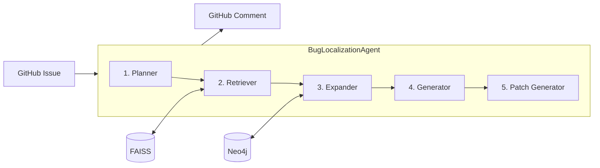

# INSIGHT - Automated Bug Localization Tool

[](https://github.com/apps/insight-issues)
[](https://www.python.org/downloads/)

INSIGHT is a GitHub application that automatically localizes bugs in software repositories using an **Agentic RAG (Retrieval-Augmented Generation)** pipeline. It analyzes GitHub issues and identifies the specific files and functions that need to be modified, then generates fixes using structured Chain-of-Thought reasoning.

## Features

✨ **Agentic RAG Pipeline**: LangGraph-based agent with 5 nodes (Planner → Retriever → Expander → Generator → Patch Generator)  
🎯 **Smart Query Generation**: Planner node decomposes issues into semantic and lexical search queries  
📊 **Graph-Augmented Retrieval**: Expander node enriches candidates with caller/callee neighbors from Neo4j  
🧠 **Chain-of-Thought Patching**: 5-step reasoning process based on ThinkRepair (ISSTA 2024)  
🌍 **Multi-Language**: Supports Python, Java, and Kotlin  
⚡ **Auto-Updates**: Automatically updates knowledge base when code changes  
📈 **High Accuracy**: 59.52% Hit@3 on LCA benchmark

## How It Works



### Agent Pipeline

| Node | Purpose | Output |
|------|---------|--------|
| **Planner** | Analyze issue, generate search queries | Semantic + lexical queries |
| **Retriever** | Hybrid search (Dense + BM25 + RRF) | Top candidates |
| **Expander** | Graph expansion (callers/callees/siblings) | Enriched candidates |
| **Generator** | LLM reasoning with evidence | Selected root cause |
| **Patch Generator** | Chain-of-Thought repair | Unified diff + commit message |

### Chain-of-Thought Patch Generation

Based on **ThinkRepair** (Yin et al., ISSTA 2024) and **SCoT** (Li et al., TOSEM 2025):

1. **Define Objective**: Analyze constraints and codebase patterns
2. **Evaluate Strategies**: Compare repair approaches (Guard Clause, Refactoring, etc.)
3. **Design Patch**: Draft the minimal code change
4. **Verify Correctness**: Simulate bug/normal/edge cases
5. **Assess Quality**: Rate minimality, consistency, and side effects

## Quick Start

### Prerequisites

- Python 3.11+
- Neo4j 5.0+
- OpenAI API key or Google API key

### Installation

1. Clone the repository:
```bash
git clone https://github.com/yourusername/issue_analyzing_tool.git
cd issue_analyzing_tool
```

2. Install dependencies:
```bash
pip install -r requirements.txt
```

3. Set up environment variables:
```bash
cd "INSIGHT Tool"
cp .env.example .env
# Edit .env with your API keys and configuration
```

4. Start Neo4j database

5. Run the application:
```bash
cd "INSIGHT Tool"
python main.py
```

## Configuration

Edit `.env` file in the `INSIGHT Tool` directory:

```env
# LLM Configuration
LLM_MODEL_NAME=gpt-4o  # or gemini-2.0-flash-exp
OPENAI_API_KEY=your_key_here
GEMINI_API_KEY=your_key_here

# Neo4j Configuration
NEO4J_URI=bolt://localhost:7687
NEO4J_USER=neo4j
NEO4J_PASSWORD=your_password

# GitHub App (if using)
GITHUB_APP_ID=your_app_id
GITHUB_PRIVATE_KEY_PATH=path_to_key.pem
```

## Usage

### As a GitHub App

1. Install the INSIGHT GitHub App on your repository
2. When an issue is created, INSIGHT will automatically:
   - Index the repository (first time only)
   - Analyze the issue using the agent pipeline
   - Post a comment with localization results and suggested fix

### Programmatic Usage

```python
from Feature_Components.Agent.agent import BugLocalizationAgent

# Initialize agent for a repository
agent = BugLocalizationAgent(
    repo_name="user/repo",
    repo_dir="/path/to/repo"
)

# Run localization with patch generation
selected, candidates, tokens, patch, reasoning = agent.localize(
    issue_title="Bug: Crash on invalid input",
    issue_body="The application crashes when...",
    generate_patch=True  # Set False for evaluation-only mode
)

print(f"Root cause: {selected[0]['name']} in {selected[0]['file_path']}")
print(f"Patch:\n{patch}")
```

### Standalone Evaluation

Run the evaluation script:

```bash
cd "Replication Package/Evaluation/Bug Localization"
python evaluate_bug_localization.py
```

This will:
- Load test dataset from `test_dataset.xlsx`
- Run bug localization on each issue
- Save results to `evaluation_results_bug_localization.xlsx`

To run without patch generation (faster evaluation):
```python
# In evaluate_bug_localization.py
result = workflow_manager.run(..., generate_patch=False)
```

## Evaluation Results

Performance on the [LCA Bug Localization benchmark](https://huggingface.co/datasets/JetBrains-Research/lca-bug-localization) (30 issues, Python/Java/Kotlin):

**File-Level**:
- **Hit@3**: 59.52%
- **Precision@5**: 56.75%
- **Recall@5**: 43.00%
- **F1@5**: 48.93%

**Function-Level**:
- **Hit@3**: 54.76%
- **F1@5**: 42.79%

## Architecture

See [ARCHITECTURE.md](ARCHITECTURE.md) for detailed system architecture and diagrams.

**Key Components**:

| File | Purpose |
|------|---------|
| `agent.py` | LangGraph-based 5-node agent (Planner → Retriever → Expander → Generator → Patch Generator) |
| `workflow_manager.py` | Orchestrates agent execution and result formatting |
| `llm_service.py` | LLM interface (GPT-4o/Gemini) with retry logic |
| `embedder.py` | Jina Embeddings v2 (8k context) |
| `vector_store.py` | FAISS index with hybrid search (Dense + BM25) |
| `graph_store.py` | Neo4j knowledge graph (CALLS, CONTAINS, INHERITS) |
| `indexer.py` | Repository indexing (AST + Vectors + Graph) |

## References

- Yin, X., et al. (2024). *ThinkRepair: Self-Directed Automated Program Repair*. ISSTA 2024.
- Li, J., et al. (2025). *Structured Chain-of-Thought Prompting for Code Generation*. ACM TOSEM.

## License

[MIT License](LICENSE)

## Citation

If you use INSIGHT in your research, please cite:

```bibtex
@software{insight2024,
  title={INSIGHT: Automated Bug Localization with Agentic RAG},
  year={2024},
  url={https://github.com/yourusername/issue_analyzing_tool}
}
```

## Contributing

Contributions are welcome! Please feel free to submit a Pull Request.

## Support

For issues and questions, please open a GitHub issue.
